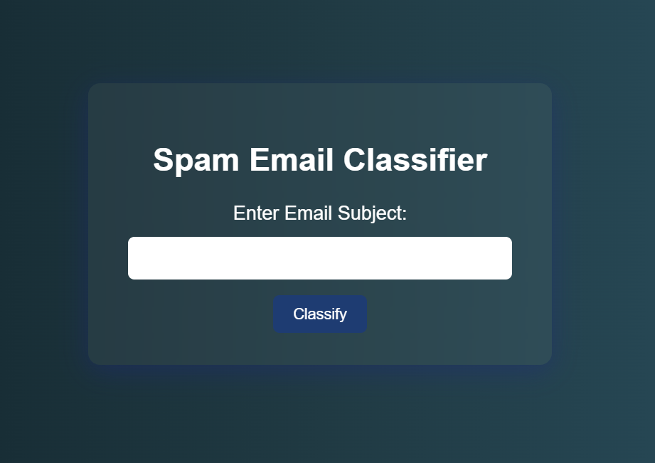

# 📧 Spam Email Classifier

A machine learning web application that classifies whether an email subject line is **Spam** or **Not Spam** using a Naive Bayes model. Built using **Python**, **Flask**, and **scikit-learn**.

---

## 🧩 Problem Statement

Spam emails have become a significant threat, cluttering user inboxes and often containing phishing links or harmful content. Efficient and real-time detection of spam can:
- Enhance user experience
- Improve security
- Reduce time spent on managing emails

While major email providers use large-scale filters, this project demonstrates how **machine learning** can be used to build a simple and effective spam classifier for email subject lines using traditional NLP techniques.

---

## 🚀 Project Overview

This project allows users to enter an email **subject line** through a web interface. Upon submission, the subject is processed using a pre-trained **Multinomial Naive Bayes** model. The result — *Spam* or *Not Spam* — is instantly displayed to the user.

---

## 🛠️ Tech Stack

| Technology | Purpose |
|------------|---------|
| **Python** | Backend logic and model training |
| **Flask** | Web framework for frontend-backend integration |
| **HTML/CSS** | UI for input and output |
| **scikit-learn** | Machine Learning - model training and prediction |
| **Pandas** | Data handling and preprocessing |

---

## ✨ Features

- 🔍 Real-time spam detection using email subject line
- 📦 Model is trained at runtime from `spam.csv`
- 🧠 ML pipeline using `CountVectorizer` + `MultinomialNB`
- 🎨 Clean, responsive, glassy-themed user interface
- 🔁 Post/Redirect/Get pattern to avoid result repetition on refresh
- 💡 Lightweight and easy to deploy

---

## 🧠 Future Scope

- ✅ Use full email content (body, metadata) for classification
- ✅ Replace `CountVectorizer` with `TF-IDF` or `word embeddings`
- ✅ Add user login and spam filtering history
- ✅ Deploy using Docker or host on platforms like Heroku or Render
- ✅ Improve UI/UX with animations and mobile responsiveness

---

## 🖥️ Setup Instructions

### 1. Clone the Repository
```bash
git clone https://github.com/SrujanPR/Spam-Email-Classifier.git
cd spam-classifier-webapp
```

### 2. Install required dependencies
```bash
pip install requirements.txt
```

### 3. Run the model
Go to the `model.ipynb` file and execute all the cells and click on save.

### 4. Run the App
Now go the `app.py` file and run it by tying the following code in the terminal
```bash
python app.py
```
Then open your browser and go to: http://127.0.0.1:5000

---

## 📁 Project Structure

```
Spam-Email-Classifier/
│
├── spam.csv                  # Dataset (SMS Spam Collection Dataset)
├── app.py                    # Flask web server and ML pipeline
├── templates/
│   └── index.html            # Frontend HTML page
├── README.md 
├── model.ipynb               # Python notebook where the model is present
├── Sample.png
└── requirements.txt
```

---

## 📸 Preview



---

## 📞 Contact

Built by **SRUJAN P R**  
Feel free to reach out for collaborations, ideas, or improvements.
Pull requests are welcome! If you’d like to improve the assistant or contribute new agents or features, feel free to fork the repo and submit a PR.

[LinkedIn](https://www.linkedin.com/in/srujanpr) • [Email](sruja2401@gmail.com)

---

## 📜 License

This project is licensed under the MIT License. See the LICENSE file for more details.

---

## ⭐ Star this repo if it helped you!
